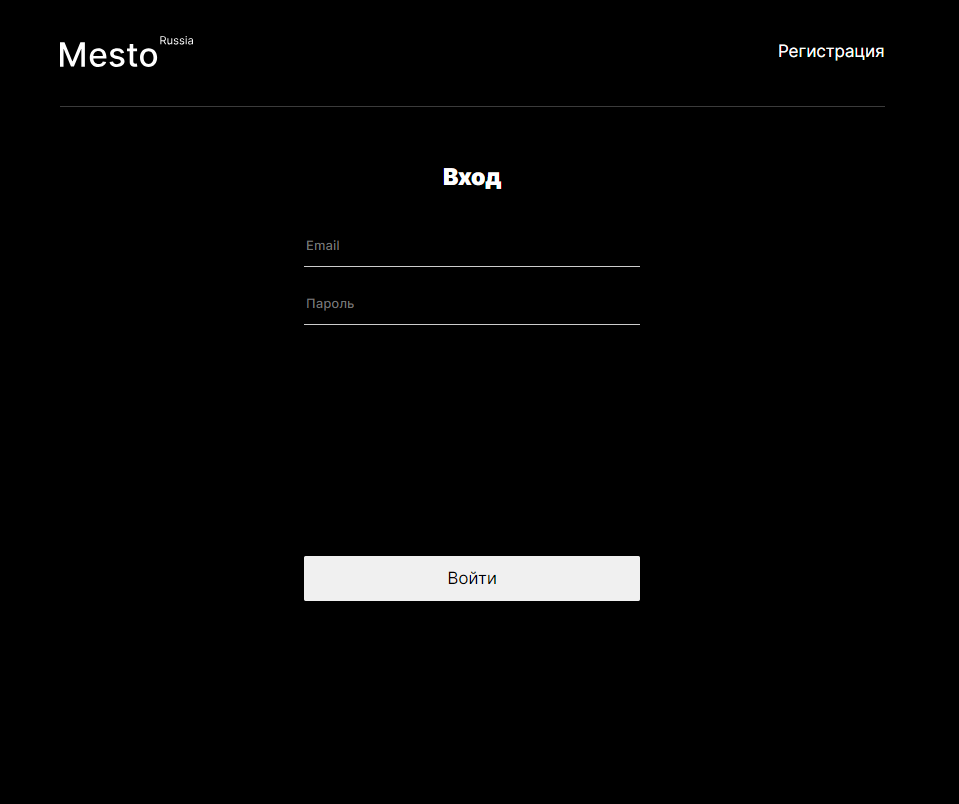

# Проект: Место React Auth

[Ссылка на GitHub Pages](https://yaroslav-chertov.github.io/react-mesto-auth/)

## Описание и функциональность

Работа представляет из себя одностраничный сайт c авторизацией и регистрацией пользователей, аналог социальной сети, где есть возможность добавлять фотографии, ставить лайки и редактировать свой профиль. Переведена на фреймворк React.


Функционал на данный момент:

* Редактирование имени и подписи в профиле пользователя;
* Редактирование аватара пользователя;
* Добавление новых фотографий;
* Возможность посмотреть отдельно любую фотографию;
* Возможность ставить лайки и удалять фотографии;

Технологии:

* БЭМ методология, файловая структура;
* ООП и разбиение на модули;
* Webpack;
* React JS.

## Инструкция по установке

Клонировать репозиторий:

`
git clone https://github.com/Yaroslav-Chertov/mesto-react-auth.git
`

В директории проекта запустить приложение в режиме разработки:

```
npm install
npm start
```
